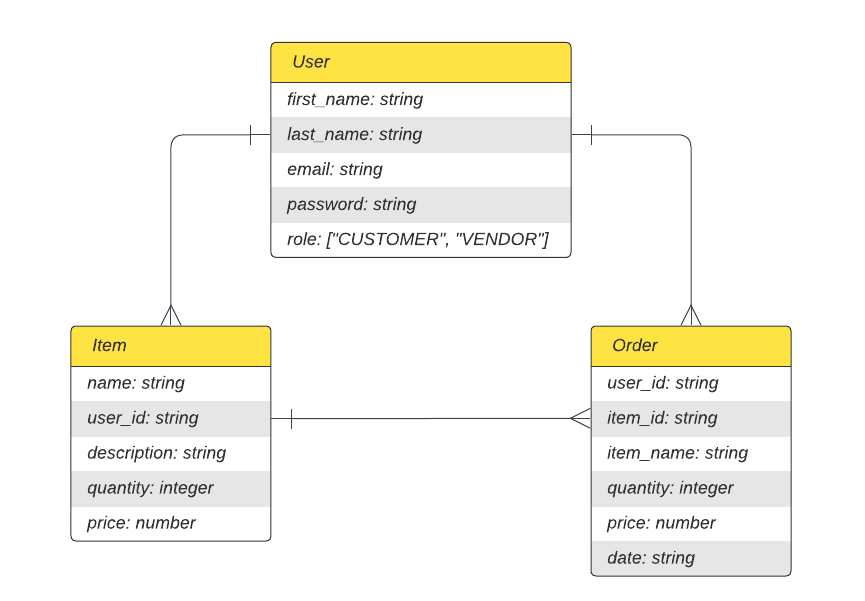

# RANS - E-Commerce Platform Tech Stack

## Remote Access via RLES

To access the already deployed stack using RLES:

1. Make sure the machine is reachable:

   ```bash
   ping 192.168.44.11
   ```

2. (OPTIONAL) Add the following line to the top of the `/etc/resolv.conf` file to resolve the DNS name:

   ```bash
   namespace 192.168.44.1
   ```

3. Access the website by navigating to <http://rans.iste444.com> _(only if step 2 was completed)_ or <http://192.168.44.11>

---

## Stack Technologies

| Name         | Version | Layer                        | Description                                                                                                                                                              |
| ------------ | ------- | ---------------------------- | ------------------------------------------------------------------------------------------------------------------------------------------------------------------------ |
| **Rust**     | `1.69`  | _REST API_                   | Rust is a fast and secure programming language ideal for building high-performance server-side applications                                                              |
| **ArangoDB** | `3.10`  | _Database_                   | ArangoDB is a flexible multi-model database that supports key-value, document, and graph data models, and provides built-in horizontal scaling and sharding capabilities |
| **Nginx**    | `1.24`  | _Web Server & Reverse Proxy_ | Nginx is a fast and reliable open-source web server and reverse proxy used for serving static and dynamic content at scale.                                              |
| **Svelte**   | `3.58`  | _Frontend_                   | Svelte is a modern front-end framework that compiles to highly efficient JavaScript, making it easy to build performant and responsive user interfaces                   |

---

## Additional Packages

This is a list of packages installed automatically during the setup

- **ansible-core** (dnf)
- **ansible.posix** (ansible-galaxy package)
- **arangosh** (dnf)
- **cargo** (independent distribution)
- **nodejs:18** (dnf)
- **pexpect** (pip package)
- **python3.9** (dnf)
- **svelte** (npm package)

---

## Setup

> PREMISE: Make sure to understand what the setup.sh script does before running it! Some changes might be disruptive.

1. **Clone the repository (Requires `git` to be installed)**

   ```bash
   git clone https://github.com/AndreaPallotta/RANS.git
   ```

2. **Navigate to the `RANS` folder**

   ```bash
   cd ./RANS
   ```

3. **Modify the [config.toml](./config/config.toml) to your preferennces**

4. **Depending on your machine, you might not have the `ens192` interface**

   - Locate the primary NIC by running

   ```bash
   ip addr
   ```

   - Change the [ifcfg-ens192](./config/ifcfg-ens192) to be `ifcfg-<your-interface-name>`
   - Inside the file, replace the `NAME` and `DEVICE` to match your interface name

5. **Change the permission for the [setup.sh](./setup.sh) file**

   ```bash
   sudo chmod +x ./setup.sh
   ```

6. **Run the [setup.sh](./setup.sh) script _(non-sudo)_ and follow the instructions**

   ```bash
   ./setup.sh
   ```

   > NOTE: The script might fail if you have custom MAC (i.e. SELinux, AppArmor, Grsecurity, RSBAC) policies or ACL rules. Contact your system administrator for more information

7. **Make sure all services have started**

   - Rust API

   ```bash
   sudo systemctl status rans.api
   ```

   - ArangoDB

   ```bash
   sudo systemctl status arangodb3
   ```

   - Nginx

   ```bash
   sudo systemctl status nginx
   ```

   - Svelte client

     - Navigate to <http://rans.iste444.com> or <http://localhost>
     - Use CLI tools like `wget` to retrieve the documentation

     ```bash
     wget rans.iste444.com/api/v1
     ```

---

## Database



> NOTE: ArangoDB is an hybrid GraphQL & NoSQL DBMS. The diagram above includes relations that are not directly found in the database but that might be useful to understand the models.

The [db_backup](./db_backup/) folder contains sample data that can be imported in ArangoDB. It is currently done automatically on setup. If you want to import it manually, run the following command:

```bash
arangorestore --server.database project2 --input-directory db_dump
```

> NOTE: Make sure the database name exists. The command will override existing collections.

To recreate the dump of the database run:

```bash
arangodump --output-directory=db_dump --server.database=project2
```

Since all passwords are hashed, this is a table with credentials for the users generated from the database dump

| email             | password   |
| ----------------- | ---------- |
| jstarb@gmail.com  | Password.1 |
| sales@baba.com    | Password.2 |
| sales@nutella.com | Password.3 |

---

## API Documentation

There are currently two ways to access the documentation:

- Remote (Redocly)

  1. Navigate to <https:/nervous-duck-98.redoc.ly>
  2. Sign In or create a new account

  > NOTE: Since the documentation is hosted remotely, you will not be able to run any query unless you have a public-facing instance of the API running.

- Local
  1. Setup and run the application
  2. Access the `/api/v1` endpoint on the browser (i.e. <http://rans.iste444.com/api/v1> or <http://localhost:3001/api/v1>)

Additionally, you can generate the UI yourself using the [docs/openapi.json](./docs/openapi.json) file

---

## Above & Beyond

Following is a list of what I believe is above and beyond the requirements of the project:

- **Complexity of the tech stack**: Besides Nginx, I never used any of the other stack components. Rust is a powerful language but makes development very hard for new users. I think I did a good job with code reusability. ArangoDB is somewhat similar to other NoSQL query languages but AQL queries are confusing. Developing is Svelte was the easiest part of this project.

- **Automation**: Setting up the tech stack has been completed automated using `bash` and `ansible`. Automation parts include installing all packages required, building the frontend and backend, setting up the database (including schemas), and more. Additionally, it automatically modifies the network interface to resolve the custom domain `rans.iste444.com`, which saves tedious work using `nmtu`

- **Custom Domain**: Connecting to frontend and backend can be done using the custom domain

- **Flexible Configuration**: The [config.toml](./config/config.toml) contains configurations used by the REST API (i.e. hostname, port, database credentials, logs, etc.) and it's customizable. There is error checking and default deserialization in the API code that handles missing or invalid fields (if possible)

- **Systemd Service**: When the Rust API is compiled, it produces a binary file. The binary file is executed as a systemd service in the background. A benefit of systemd is that start on boot, restart, and stop can be specified in the service file. This prevents issues like spawning identical processes.

- **JWT**: JWTs allowed to implement a more secure and reliable authentication system. All protected routes require a valid JWT. Refreshing JWTs is automated by the server so the user will never be signed out automatically.

- **Extra Endpoints**: Besides the 5 required endpoints, there are endpoints for authentication, managing an extra database model, and documentation

- **API Documentation**: The API documentation is dynamically generated using OpenAPI and accessible via the `/api/v1` endpoint. The documentation page contains executable endpoints and a list of interfaces used to deserialize requests and serialize responses. In addition to the API documentation, a Rust documentation is generated on build

- **Request/Response Handling Modularity**: Ensuring that all endpoints return the same data structure and using a generic function approach for handling requests helped to improve code modularity and consistency
